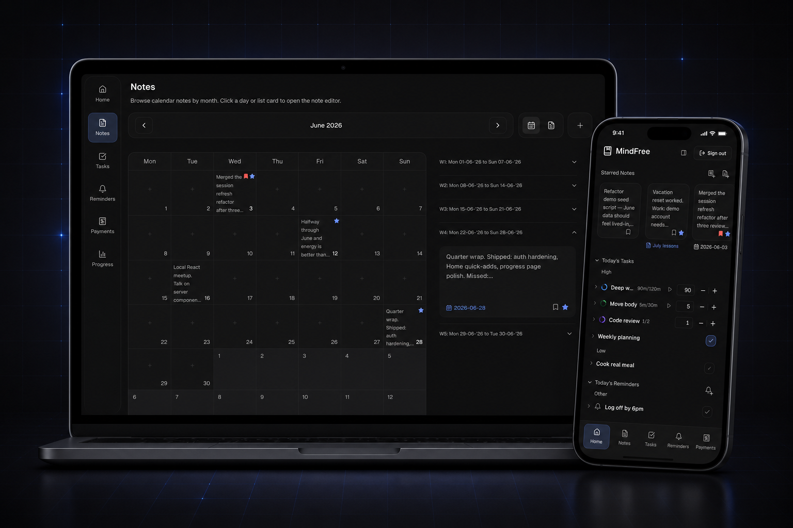

# MindFree

Mobile-first notes today — with tasks, progress, and reminders planned next. Built with Next.js, React, Supabase, and a custom theme system inspired by Notion and Material Design 3.



## Questions this app answers

| Question | Answer |
| -------- | ------ |
| I want a **quick note on the go** | Home quick slot — content-first, one per user |
| I want to **write on a calendar** | Calendar view, month grid, or expanded day in the drawer |
| I have a **project** I want to write about | General notes (undated), on the Notes page |
| Can Home be **easy access** to specific notes? | Star notes → Home starred strip |
| Some days are **important** | Flag as important → dark red border on that calendar day |
| Phone / laptop without refresh? | **Live sync** via Supabase realtime into shared caches |
| Two tabs, different pages? | Same TanStack cache + realtime; offline tabs merge via `storage` |
| I went **offline** — is data saved? | Browser queue (per user), flush on reconnect / focus |
| Will the **database stay clean**? | Calendar notes with cleared content are deleted; general notes are not auto-deleted |

## Get running locally

You need **Node.js**, a **Supabase** project, and env vars from `.env.example`.

Full walkthrough (auth dashboard, migrations, smoke test):

**[docs/setup/0-quick-setup.md](docs/setup/0-quick-setup.md)**

```bash
npm install
cp .env.example .env   # fill Supabase URL + publishable key
npm run dev
```

## Features

### Notes _(shipped)_

One notes domain: calendar days, undated general notes, and a Home quick slot. Shared drawer with autosave, optimistic UI, live sync, and a simple offline queue. Home is a consumer of the same entity — not a fork.

- [Note entity](entities/note/README.md) — domain, read models, writes, sync
- [Notes page](views/notes/README.md) — calendar / lists / drawer wiring
- [Home notes strip](views/home/docs/notes-strip.md) — quick + starred
- [Glossary](docs/concepts/glossary.md) · [Architecture](docs/architecture/README.md) · [ADRs](docs/adr/README.md)

### Tasks _(coming soon)_

Daily task tracking with assignments and completion — product model lives under `app/development/workflow/project-model/`.

### Progress _(coming soon)_

Analytics derived from task completion (not a separate progress table).

### Reminders _(coming soon)_

Standalone reminders list and Home stack.

### Profile _(coming soon)_

Theme preferences and app lock settings.

## Documentation

Start at **[docs/README.md](docs/README.md)** for reading order (setup → concepts → architecture → Notes).
