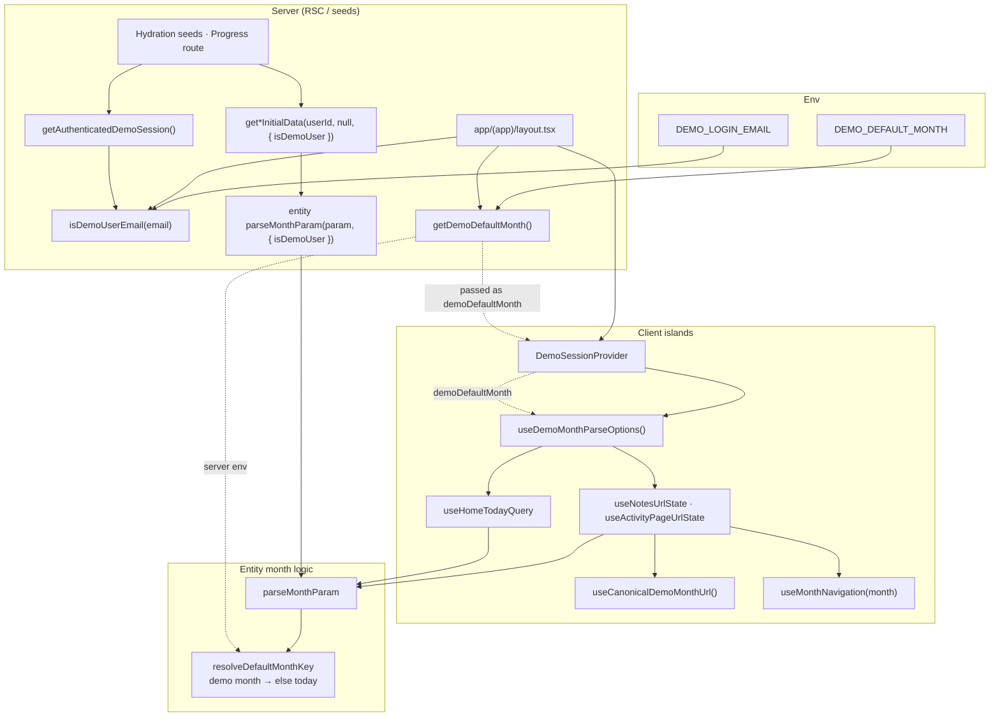
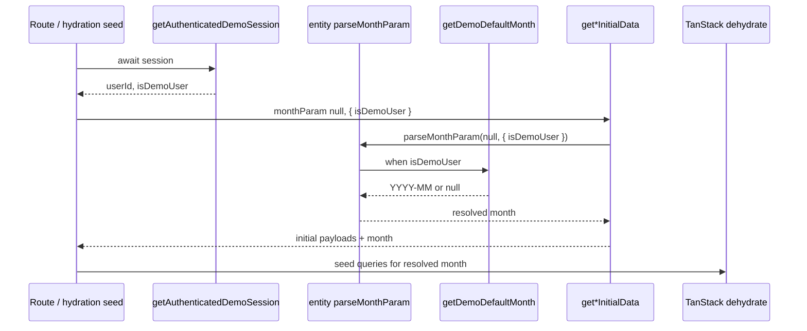
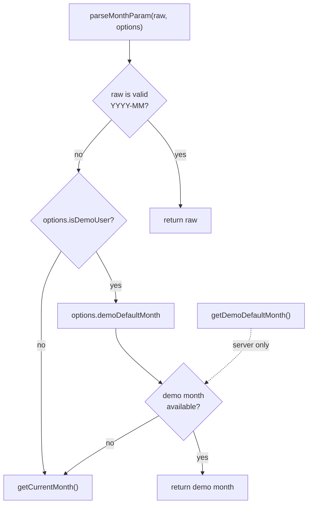

# Demo default month

How the shared demo account lands on a **fixed calendar month** (`DEMO_DEFAULT_MONTH`)
instead of the real “today” month when month-scoped routes have no valid `?month=`
param.

Regular users are unchanged — missing/invalid `?month=` still resolves to local
today via each entity’s `parseMonthParam`.

Related:

- [user-session-and-preferences.md](./user-session-and-preferences.md) — demo Profile gate, session helpers
- [routing.md](./routing.md) — `?month=` URL ownership
- [shared/lib/auth/README.md](../../shared/lib/auth/README.md) — demo login env vars
- [ADR 0004 — URL-owned application state](../adr/0004-url-owned-application-state.md)

---

## Problem

Nav links are monthless (`/notes`, `/tasks`, `/progress`, …). Every month-scoped
surface falls back when `?month=` is absent. Demo seed data lives in a past month,
so the demo account often opened an **empty current month**.

---

## Configuration

```env
# Demo login (local/staging only)
ENABLE_DEMO_LOGIN=true
DEMO_LOGIN_EMAIL=demo@example.com
DEMO_LOGIN_PASSWORD=…

# Fixed month when ?month= is missing for the demo email (YYYY-MM)
DEMO_DEFAULT_MONTH=2026-06
```

| Variable | Scope | Notes |
| -------- | ----- | ----- |
| `DEMO_LOGIN_EMAIL` | Server | Identity check via `isDemoUserEmail()` |
| `DEMO_DEFAULT_MONTH` | Server | Validated in `getDemoDefaultMonth()`; must match seeded data |
| `ENABLE_DEMO_LOGIN` | Server | Gates Try Demo UI only — **not** required for default month |

Nav hrefs stay monthless by design. Defaults apply at **resolution time**, not in
`shared/config/app-navigation.ts`.

---

## Mental model

| Layer | Responsibility |
| ----- | -------------- |
| `shared/lib/auth/demo-login-config.ts` | `isDemoUserEmail`, `getDemoDefaultMonth` |
| `shared/lib/auth/get-demo-session.ts` | Server `{ userId, isDemoUser }` for SSR |
| `shared/demo-session/` | Client `DemoSessionProvider` + `useDemoMonthParseOptions()` |
| `entities/*/lib/parse-month.ts` | **Logic:** `parseMonthParam(value, { isDemoUser, demoDefaultMonth? })` |
| `shared/month-navigator/` | **UI only:** prev/next URL mutation, `useCanonicalDemoMonthUrl` |
| Views / features URL hooks | Read `?month=`, call entity `parseMonthParam`, optional URL canonicalize |

`useMonthNavigation` is **not** involved in default selection — it only writes
`?month=` once a month key is already resolved.

---

## End-to-end data flow



---

## Server path



**Mount points**

| Surface | Server entry | Demo flag source |
| ------- | ------------ | ---------------- |
| Notes | `views/notes/ui/notes-hydration-seed.tsx` | `getAuthenticatedDemoSession()` |
| Tasks | `views/tasks/ui/tasks-hydration-seed.tsx` | same |
| Reminders | `views/reminders/ui/reminders-hydration-seed.tsx` | same |
| Payments | `views/payments/ui/payments-hydration-seed.tsx` | same |
| Home activity | `views/home/ui/home-hydration-seed.tsx` → `getHomeActivityInitialData` | `{ isDemoUser }` |
| Progress | `app/(app)/progress/page.tsx` | `parseMonthParam(?month, { isDemoUser })` |

---

## Client path

Env vars are **not** readable in the browser bundle. The layout resolves the demo
month once on the server and passes it through context.

```mermaid
sequenceDiagram
  participant Layout as ProtectedAppLayoutContent
  participant Env as getDemoDefaultMonth
  participant Provider as DemoSessionProvider
  participant Hook as useDemoMonthParseOptions
  participant Parse as entity parseMonthParam
  participant Router as router.replace

  Layout->>Env: isDemoUser ? getDemoDefaultMonth() : null
  Layout->>Provider: isDemoUser, demoDefaultMonth
  Provider->>Hook: context
  Hook->>Parse: { isDemoUser, demoDefaultMonth }
  Note over Parse: Skips env; uses demoDefaultMonth from context
  Hook->>Router: useCanonicalDemoMonthUrl when ?month invalid
  Router-->>Router: /notes → /notes?month=2026-06
```

**Mount points**

| Surface | Client hook | Canonical URL |
| ------- | ----------- | ------------- |
| Notes | `views/notes/model/use-notes-url-state.ts` | yes |
| Tasks / Reminders | `features/activity/activity-page/model/use-activity-page-url-state.ts` | yes |
| Payments | `views/payments/model/use-payments-url-state.ts` | yes |
| Home Today | `entities/activity/hooks/use-home-today-query.ts` | no (no `?month=` on `/`) |
| Progress | Server-resolved month → `ProgressMonthNavigator` | not wired (optional) |

---

## `parseMonthParam` decision

Lives in **entity** code (`entities/note/lib/parse-month.ts`,
`entities/activity/lib/month/parse-month.ts`,
`entities/payment/lib/parse-month.ts`) — not in `shared/month-navigator`.



Explicit `?month=YYYY-MM` always wins for both demo and regular users.

---

## URL canonicalization (demo only)

`shared/month-navigator/model/use-canonical-demo-month-url.ts`:

- Runs in month URL hooks after `useDemoMonthParseOptions()` is available
- If demo user + valid `DEMO_DEFAULT_MONTH` + missing/invalid `?month=` →
  `router.replace` same path with `?month=<demoDefault>` (preserves `view`, etc.)
- Stops once the URL contains a valid month — does not fight prev/next navigation

---

## Key files

| File | Role |
| ---- | ---- |
| `shared/lib/auth/demo-login-config.ts` | `isDemoUserEmail`, `getDemoDefaultMonth` |
| `shared/lib/auth/get-demo-session.ts` | SSR `{ userId, isDemoUser }` |
| `shared/demo-session/` | Client context + `useDemoMonthParseOptions` |
| `app/(app)/layout.tsx` | Resolves demo flag + month; mounts provider |
| `entities/*/lib/parse-month.ts` | Demo-aware default month logic |
| `shared/month-navigator/model/use-canonical-demo-month-url.ts` | Demo URL rewrite |
| `shared/month-navigator/model/use-month-navigation.ts` | Prev/next only — **no defaults** |

---

## Verification

| Action | Demo user | Regular user |
| ------ | --------- | -------------- |
| Nav → Notes (no query) | Demo month data; URL may canonicalize to `?month=` | Current month |
| Nav → Tasks / Reminders | Same | Current month |
| Nav → Progress | Demo month cards | Current month |
| Home → Today's tasks | Records from demo month bucket | Current month |
| Month switcher | Explicit month works | Same |
| Invalid `?month=foo` | Falls back to demo month | Falls back to today |

---

## Checklist for new month-scoped surfaces

1. **Server seed or route** — `getAuthenticatedDemoSession()` + pass `{ isDemoUser }` into entity initial-data or `parseMonthParam`.
2. **Client URL hook** — `useDemoMonthParseOptions()` + entity `parseMonthParam`.
3. **Optional** — `useCanonicalDemoMonthUrl()` if the page owns `?month=`.
4. **Do not** add default logic to `useMonthNavigation` or duplicate month parsing in the view.
