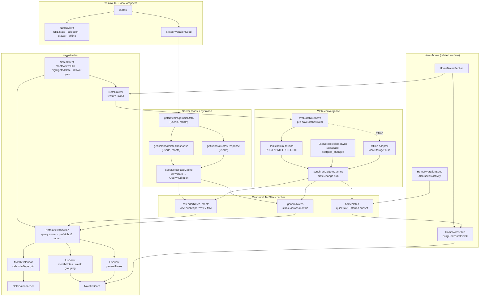

# Notes page data flow

How Notes travel from SSR hydration through three TanStack read models to the
calendar, list views, and shared drawer island. Home reuses the same entity
writes and cache hub through a fourth read model.

**Read models:** [entities/note/docs/read-models.md](../../../entities/note/docs/read-models.md)
**Shared ownership:** [entities/note/RESPONSIBILITIES.md](../../../entities/note/RESPONSIBILITIES.md)
**App-wide pattern:** [docs/architecture/data-flow.md](../../../docs/architecture/data-flow.md)

---

## The whole path



---

## Thin route, one page workflow

```text
/notes
  ├─ NotesHydrationSeed
  │    └─ getNotesPageInitialData(userId, null)
  │         ├─ getCalendarNotesResponse(userId, resolvedMonth)
  │         └─ getGeneralNotesResponse(userId)
  └─ NotesClient
       ├─ useNotesUrlState()        → ?month= · ?view=
       ├─ useNotesPageSelection()    → highlightedDate (in-month only)
       ├─ useNotesDrawer()           → open edit / create / quick
       ├─ useNotesRealtimeSync()     → cache hub + drawer bridge
       ├─ useOfflineSync()           → flush pending writes
       └─ NotesViewsSection + NoteDrawer
```

The route file only composes server hydration and the client shell as parallel
Suspense siblings. Month and view toggles stay on the client so the shell does
not remount on every URL change.

`NotesClient` owns the reusable Notes page workflow:

- month/view URL state and in-month highlighted day;
- drawer open requests (edit id, create for date, create general);
- offline banner + reconnect flush;
- realtime subscription scoped to the signed-in user;
- responsive calendar/list composition via `NotesViewsSection`.

---

## Server → canonical caches

`getNotesPageInitialData(userId, monthParam)` fetches in parallel:

```text
getCalendarNotesResponse(userId, resolvedMonth)
getGeneralNotesResponse(userId)
```

`seedNotesPageCache(queryClient, data)` then writes:

```text
["calendarNotes", data.month]   → calendarDays + monthNotes for this month
["generalNotes"]                → undated, non-quick notes (not month-scoped)
```

The seed component dehydrates once into `QueryHydration`. First paint therefore
reads canonical cache data without a client round-trip. General notes stay stable
while month navigation changes only the calendar key.

Home uses the related `getHomeNotesResponse` / `seedHomeNotesCache` pair
because it needs the quick slot and starred subset, not a full month grid.
`HomeHydrationSeed` composes note + activity seeders into one dehydrate.

---

## Cache → `NotesViewsSection`

`NotesViewsSection` is the shared query owner for the Notes page body:

```text
useCalendarNotesQuery(month)  → ["calendarNotes", month]
useGeneralNotesQuery()        → ["generalNotes"]
resolveViewQueryState(...)    → loading | error | ready
usePrefetchAdjacentCalendarMonths(month)  → warm ±1 months when active month succeeds
```

On mobile it mounts one view at a time (`calendar`, `month-notes`, or
`general-notes`). On desktop the calendar view renders the month grid and a
sidebar month-notes list side by side. The component is memoized so opening the
drawer in `NotesClient` does not re-render the calendar/list tree when props
stay stable.

---

## Calendar endpoint

```text
calendarNotes.calendarDays
  → MonthCalendar
  → NoteCalendarCell
  → onCalendarDaySelect(day)
       ├─ note exists → drawer.openEdit(note.id)
       └─ empty day   → drawer.openCreateForDate(day.date)
```

- `calendarDays` is server-aggregated: one entry per day in the month with
  `note` or `null` (UI-ready grid).
- Page selection (`highlightedDate`) is separate from drawer `activeDate` — the
  user can browse July on the page while editing a March day in the drawer
  ([drawer-navigation.md](./drawer-navigation.md), ADR 0005).
- Month chevrons update URL `?month=` and swap the calendar query key; general
  notes do not refetch.

---

## List endpoints

### Month notes (`?view=month-notes` or calendar sidebar)

```text
calendarNotes.monthNotes
  → ListView + WeekOrganizer
  → NoteListCard (variant="mobile" in sidebar)
  → onNoteClick(note) → selectDate + drawer.openEdit
```

Reuses the same calendar month bucket — no second fetch. Week grouping and empty
week copy are view preferences, not entity rules.

### General notes (`?view=general-notes`)

```text
generalNotes.generalNotes
  → ListView
  → NoteListCard
  → onNoteClick(note) → drawer.openEdit
```

The list deliberately does not subscribe to month navigation. Toggling month on
the calendar view does not re-render general list cards when that view is
unmounted.

---

## Drawer and writes

`NoteDrawer` is a feature island shared by Notes and Home:

```text
useNotesDrawer()           ← views/notes/model/editor (open/close requests)
NoteDrawer                 ← features/notes/note-drawer (resolve note, date nav)
  useResolvedDrawerNote    ← cache lookup by activeDate or note id
  NoteForm                 ← entities/note/editor (fields, dirty state)
  usePreSaveOrchestrator   ← evaluateNoteSave → debounce → mutation | offline
```

Date-nav mode resolves the note from `["calendarNotes", monthOf(activeDate)]`.
There is no per-open `GET /notes/:id` when the month bucket is warm.

Write paths converge through one hub:

```text
form onChange
  → evaluateNoteSave (pure)
  → debounce (~600ms)
  → online: TanStack mutation → thin API route → entity use-case → repository
       onMutate / onSuccess → synchronizeNoteCaches(NoteChange)
  → offline: pending localStorage → optimistic hub → flush on reconnect
  → realtime: postgres_changes → applyRealtimeNoteChange → same hub
```

A calendar create/patch/delete updates its month bucket and may also touch
`generalNotes` and `homeNotes` membership (date moves, quick graduation,
star/important toggles). Callers do not hand-roll three `setQueryData`s.

---

## Home strip (fourth read model)

```text
GET /api/notes/home → HomeNotesResponse
TanStack key: ["homeNotes"]

HomeNotesStrip
  ├─ quickNote slot (or placeholder → openCreateQuick)
  └─ starredNotes → NoteListCard (variant="home")
```

Home reads and writes through the same entity. Starring on Home updates the
Notes page caches via `synchronizeNoteCaches`; Notes page edits update Home on
the next hub pass. Realtime and offline adapters on Home use the same bridge as
`NotesClient`.

---

## Re-render and cache boundaries

| Concern | Mechanism |
| ------- | --------- |
| Drawer open does not rebuild the grid | memoized `NotesViewsSection` with stable callbacks |
| Month navigation refetches calendar only | calendar keyed by month; general keyed globally |
| General list does not flash on month change | separate `["generalNotes"]` cache |
| Home strip stays independent of page month | separate `["homeNotes"]` cache |
| Cross-surface consistency after writes | `synchronizeNoteCaches` + `NoteChange` union |
| Stale PATCH responses do not roll back newer edits | `onSuccess` gated by `lastEditedAt` |
| Offline writes survive refresh | user-scoped localStorage + `storage` event across tabs |

---

## Related

| Doc | Why |
| --- | --- |
| [read-models.md](../../../entities/note/docs/read-models.md) | Three Notes caches + Home payload shapes |
| [writes-and-autosave.md](../../../entities/note/docs/writes-and-autosave.md) | Orchestrator actions and mutation surfaces |
| [drawer-navigation.md](./drawer-navigation.md) | Page month vs drawer `activeDate` |
| [quick-note.md](../../../entities/note/docs/quick-note.md) | Quick slot graduation and promotion |
| [realtime.md](../../../entities/note/docs/realtime.md) | Supabase → cache hub |
| [offline.md](../../../entities/note/docs/offline.md) | Pending writes and flush adapter |
| [ADR 0004](../../../docs/adr/0004-url-owned-application-state.md) | URL-owned month/view |
| [ADR 0005](../../../docs/adr/0005-selected-date-not-selected-note.md) | Selected date, not selected note |
| [ADR 0006](../../../docs/adr/0006-pre-save-orchestrator.md) | Why save logic sits before mutations |
| [ADR 0007](../../../docs/adr/0007-synchronize-note-caches-hub.md) | Cache fan-out hub |
| [views/home/docs/notes-strip.md](../../home/docs/notes-strip.md) | Home strip implementation plan |
