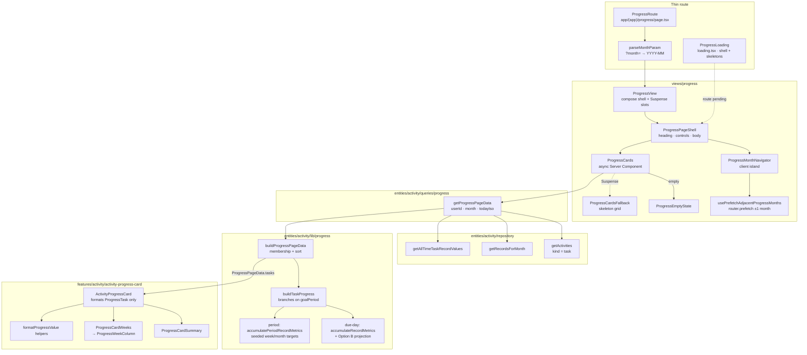

# Progress page data flow

How `/progress` travels from a URL month to a dumb report card — pure SSR, no
TanStack hydrate.

**Calculation model:** [entities/activity/docs/progress.md](../../../entities/activity/docs/progress.md)  
**File map:** [entities/activity/docs/responsibilities.md](../../../entities/activity/docs/responsibilities.md)  
**Rendering exception:** [docs/architecture/rendering.md](../../../docs/architecture/rendering.md)

---

## Why pure SSR (no TanStack hydrate)

Tasks and Home need shared client caches: drawers, optimistic writes, and
month/view toggles that must not remount the whole page. Progress has **none**
of that — it is a read-only monthly report.

| Concern | Tasks / Home | Progress |
| ------- | ------------ | -------- |
| Interactivity | Calendar, list, drawers, quick-record | Month navigator only |
| Data ownership after first paint | TanStack `["activities"]` + `["activityRecords"]` | None — HTML from the Server Component |
| Month change | Client URL + query key swap (shell stays) | RSC navigation on `?month=` |
| Freshness after a write | Cache hub patches keys immediately | Next visit / navigation to `/progress` |

So Progress does **not** use a progress API, hydration seed, or client progress
cache. The Tasks/Home TanStack caches cannot be read by a Server Component
anyway, and Progress needs a different assembled read model
(`ProgressPageData`) than those flat caches.

---

## The whole path



The graph stops at presentation: once `ActivityProgressCard` receives a
`ProgressTask`, it only formats. Attainment rules live in
[progress.md](../../../entities/activity/docs/progress.md) — including the
period-goal path when `goalPeriod` is set (week/month targets, prorated edge
weeks). Card numbers may come from either due-day Option B or period-goal
accumulation; this page doc does not duplicate those rules.

---

## Fetching strategy

```text
/progress?month=YYYY-MM
  └─ ProgressRoute
       parseMonthParam(searchParams.month)
       └─ ProgressView(month)
            ├─ ProgressMonthNavigator          ← client island
            └─ ProgressCards(month)            ← async RSC under Suspense
                 await connection()
                 getAuthenticatedUserId()
                 getTodayIsoDate()
                 getProgressPageData(userId, month, todayIso)
                   ├─ Promise.all:
                   │    getActivities(userId, "task")
                   │    getRecordsForMonth(userId, month)
                   ├─ filter month records to task ids
                   ├─ getAllTimeTaskRecordValues(userId, taskIds)
                   └─ buildProgressPageData(...)
                        └─ buildTaskProgress per included task
                 └─ ListView → ActivityProgressCard(task)
```

`todayIso` is resolved once at the `ProgressCards` boundary (`connection()` +
`getTodayIsoDate`) and injected into the query so calculation stays
deterministic and testable — never `new Date()` inside pure builders.

Server failures bubble to the nearest route error boundary. There is no client
query error state for Progress.

---

## Caching and warming

| Layer | What Progress uses |
| ----- | ------------------ |
| Selected month | URL `?month=YYYY-MM`, parsed on the server |
| Month change | Full RSC navigation (segment remount); `loading.tsx` shows the same shell + skeletons |
| Adjacent warmth | `usePrefetchAdjacentProgressMonths` → `router.prefetch` for `month ± 1` (preserves other search params) |
| Prefetch store | Next Router Cache (RSC payload), **not** TanStack keys |
| Persistent Data Cache | **None in V1** — keeps the report fresh after Tasks/Home writes without per-user invalidation |

Contrast with Notes/Tasks: those prefetch adjacent **TanStack** month keys so
client islands stay warm. Progress warms **routes**, because the report is the
route.

---

## Page composition

```text
ProgressPageShell
  ├─ monthControls → ProgressMonthNavigator (Suspense)
  └─ children      → ProgressCards (Suspense → ProgressCardsFallback)
```

`ProgressLoading` (`app/(app)/progress/loading.tsx`) reuses the same shell so
initial load and month navigations do not shift chrome.

The only intentional Progress client island is the month navigator (URL +
prefetch). `ListView` may pull shared week-grouping client modules; they are
layout helpers, not a Progress data cache.

---

## Card receives a finished model

```text
ProgressTask
  ├─ title, color, icon, trackingMode, goalPeriod, archivedAt
  ├─ month   → percent, metrics[], legacyMetrics[]
  ├─ allTime → metrics[]
  └─ weeks[] → weekNumber, percent, metrics[], legacyMetrics[]
         ↓
ActivityProgressCard
  ├─ DonutChart(month.percent)
  ├─ ProgressCardSummary     ← format only (“Weekly/Monthly done” when period)
  └─ ProgressCardWeeks       ← "—" when week.percent === null
```

If `page.tasks.length === 0`, `ProgressCards` renders `ProgressEmptyState`
instead of the grid.

---

## Related

| Doc | Why |
| --- | --- |
| [entities/activity/docs/progress.md](../../../entities/activity/docs/progress.md) | Due-day Option B **and** period-goal path, dashes, modes, legacy, membership |
| [entities/activity/docs/read-models.md](../../../entities/activity/docs/read-models.md) | Client caches Progress does **not** use |
| [views/tasks/docs/data-flow.md](../../tasks/docs/data-flow.md) | Contrast: hydrate → TanStack → client panes |
| [docs/architecture/caching.md](../../../docs/architecture/caching.md) | Progress listed under “what not to cache” |
| [docs/architecture/rendering.md](../../../docs/architecture/rendering.md) | Pure-SSR exception note |
