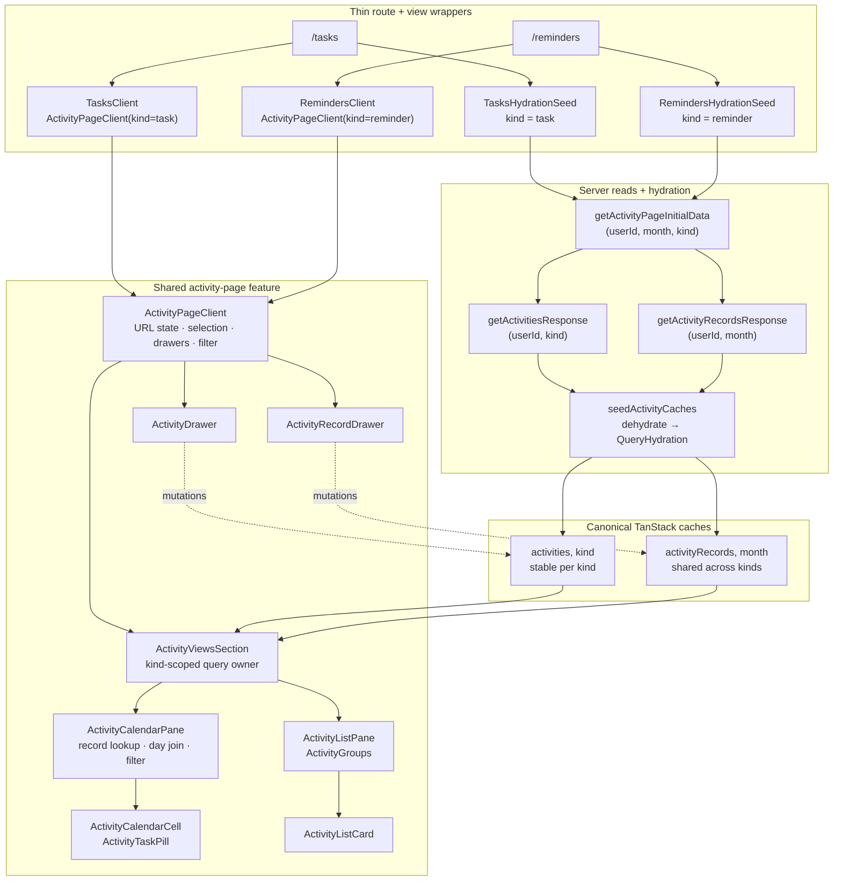

# Activity page data flow

How Tasks and Reminders travel from kind-scoped SSR hydration to the shared
calendar/list endpoints. This file remains under `views/tasks/docs/` for
historical continuity; the implemented page workflow lives in
`features/activity/activity-page/`.

**Read models:** [entities/activity/docs/read-models.md](../../../entities/activity/docs/read-models.md)
**Shared ownership:** [entities/activity/docs/responsibilities.md](../../../entities/activity/docs/responsibilities.md)
**App-wide pattern:** [docs/architecture/data-flow.md](../../../docs/architecture/data-flow.md)

---

## The whole path



---

## Thin wrappers, one page workflow

```text
/tasks
  ├─ TasksHydrationSeed
  │    └─ getActivityPageInitialData(userId, null, "task")
  └─ TasksClient
       └─ ActivityPageClient(kind="task", copy...)

/reminders
  ├─ RemindersHydrationSeed
  │    └─ getActivityPageInitialData(userId, null, "reminder")
  └─ RemindersClient
       └─ ActivityPageClient(kind="reminder", copy...)
```

The route files only compose server hydration and the client wrapper as
parallel Suspense siblings. The two view clients provide `kind`, title, and
subtitle; they do not own separate calendar, list, filter, selection, or drawer
implementations.

`ActivityPageClient` owns the reusable workflow:

- month/view URL state and selected day;
- definition and selected-day records drawer state;
- kind-aware labels and Add behavior;
- the calendar-only filter provider;
- responsive calendar/list composition;
- realtime subscription (`useActivityRealtimeSync`) scoped to the signed-in user,
  with definition-drawer notify for idle/clean remote pulls.

---

## Server → canonical caches

`getActivityPageInitialData(userId, monthParam, kind)` fetches in parallel:

```text
getActivitiesResponse(userId, kind)
getActivityRecordsResponse(userId, resolvedMonth)
```

`seedActivityCaches(queryClient, data)` then writes:

```text
["activities", data.kind]          → definitions for this surface
["activityRecords", data.month]    → records shared across both kinds
```

The seed component dehydrates once into `QueryHydration`. First paint therefore
reads canonical cache data without a client round-trip. Definitions stay stable
while month navigation changes only the records key.

Home uses the related `getHomeActivityInitialData` /
`seedHomeActivityCaches` pair because it needs both definition kinds but still
only one current-month records response.

---

## Cache → `ActivityViewsSection`

`ActivityViewsSection` is the shared query owner:

```text
useActivitiesQuery(kind)       → ["activities", kind]
useActivityRecordsQuery(month) → ["activityRecords", month]
resolveViewQueryState(...)     → loading | error | ready
```

On mobile it mounts the selected calendar or list view. On desktop the calendar
and list render side by side. The component is memoized so opening either drawer
does not re-render the view tree when its props remain stable.

---

## Calendar endpoint

`ActivityCalendarPane` is the filter consumer:

```text
records → buildRecordLookup
month + definitions + lookup
  → buildTaskCalendarDays
  → filter by isShown + isDayActivityShown(showIncomplete)
  → MonthCalendar
  → ActivityCalendarCell
  → ActivityTaskPill
```

The legacy `TaskCalendarDay` / `buildTaskCalendarDays` names describe the domain
shape, not page ownership; both activity kinds use them.

- A persisted record always keeps its day visible; schedule matching only adds
  empty due slots
  ([ADR 0012](../../../docs/adr/0012-calendar-records-always-visible.md)).
- Task pills use `deriveTodayProgress` + `formatPillProgress` for compact
  `1/2`, `5m/5m`, or combined labels.
- Reminder pills suppress numeric progress and show boolean done/not-done.
- Filtering belongs to this pane, not the entity join: hidden definitions and
  incomplete-day visibility are page preferences.

---

## List endpoint

`ActivityListPane` consumes definitions only:

```text
activities
  → ActivityGroups
       active   = active + upcoming
       inactive = expired + archived
  → ActivityListCard
```

The list deliberately does not subscribe to the calendar filter, so toggling
that filter does not re-render list cards. Group empty copy is supplied by the
kind-aware page copy. Task cards may show their color accent; reminder cards
stay theme-neutral.

---

## Drawers and writes

`ActivityPageClient` coordinates two independent shared drawers:

- `ActivityDrawer` creates/edits a definition using the page-owned `kind`.
- `ActivityRecordDrawer` edits records for the selected calendar day and reads
  definitions from the matching kind cache.

Definition and record mutations converge through
`synchronizeActivityCaches`. A definition change updates only
`["activities", kind]`; a record change updates its shared month bucket. Tasks,
Reminders, and Home recompute from those same keys without page-specific sync
branches.

Realtime (`postgres_changes` on `mf_task` + `mf_task_record`) maps into the same
hub via apply adapters — sources differ; cache rules do not. See
[realtime.md](../../../entities/activity/docs/realtime.md).

---

## Re-render and cache boundaries

| Concern | Mechanism |
| ------- | --------- |
| Filter toggle affects only the calendar | `ActivityFilterProvider`; `ActivityCalendarPane` consumes it, `ActivityListPane` does not |
| Drawer state does not rebuild the grid | memoized `ActivityViewsSection` with stable props |
| Month navigation refetches records only | records keyed by month; definitions keyed by kind |
| Task and reminder definitions do not mix | every definition query/seed receives `kind` |
| Records remain shared | one `["activityRecords", month]` key for both kinds |

---

## Related

| Doc | Why |
| --- | --- |
| [read-models.md](../../../entities/activity/docs/read-models.md) | Kind-scoped definitions, shared records, and joins |
| [writes-and-autosave.md](../../../entities/activity/docs/writes-and-autosave.md) | Definition/record writes back into canonical caches |
| [realtime.md](../../../entities/activity/docs/realtime.md) | Live sync → same hub; Progress excluded |
| [calendar-cell.md](../../../features/activity/activity-calendar-cell/docs/calendar-cell.md) | Calendar pill presentation |
| [scheduling.md](../../../entities/activity/docs/scheduling.md) | Due-day and lifecycle rules |
| [ADR 0011](../../../docs/adr/0011-one-activity-model-two-kinds.md) | Why Tasks and Reminders share one model and page workflow |
| [ADR 0014](../../../docs/adr/0014-flat-records-client-side-join.md) | Why records stay flat and views join client-side |
