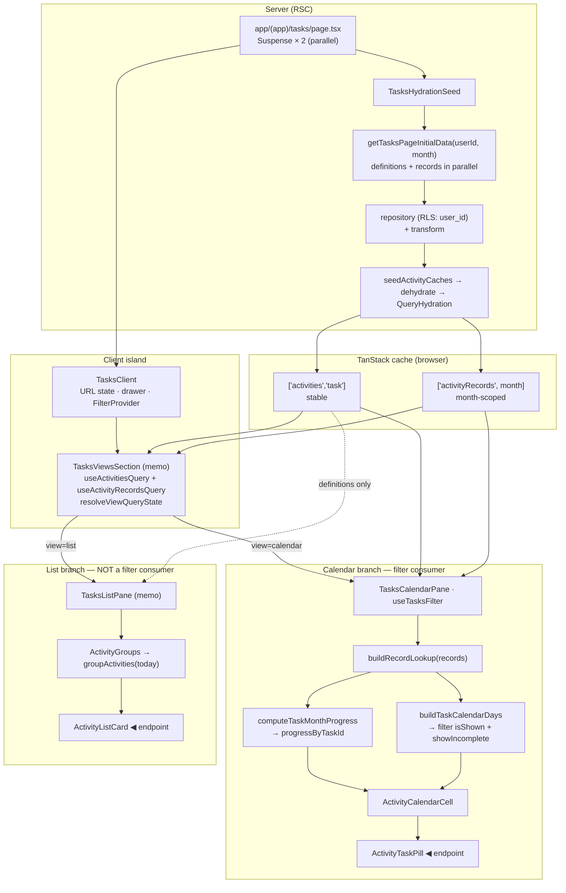

# Tasks page data flow

How task data travels from the server fetch to the two render endpoints — the
**calendar cell / pill** and the **activity list card**.

**Read models:** [entities/activity/docs/read-models.md](../../../entities/activity/docs/read-models.md)
**App-wide pattern:** [docs/architecture/data-flow.md](../../../docs/architecture/data-flow.md)

---

## The whole path



---

## Server → cache (once, on load)

```text
page.tsx
  ├─ <TasksHydrationSeed>   (server, non-blocking sibling)
  │     getAuthenticatedUserId()
  │     getTasksPageInitialData(userId, null)      // month defaults to current
  │        ├─ getActivitiesResponse(userId,"task")  ─┐ parallel
  │        └─ getActivityRecordsResponse(userId,mo) ─┘
  │            → repository (user_id + RLS) → transform (sort)
  │     seedActivityCaches(qc, data)
  │        setQueryData(['activities','task'],   definitions)
  │        setQueryData(['activityRecords', mo], records)
  │     → <QueryHydration state={dehydrate(qc)}>
  └─ <TasksClient>          (client shell, renders in parallel)
```

The route is a **thin shell** ([project-structure §7](../../../.cursor/rules/project-structure.mdc)):
it only composes the two Suspense children. All fetching lives in the entity
(`server.ts` use-cases), so first paint reads from the hydrated cache with no
client round-trip.

---

## Cache → view shell

`TasksClient` owns URL state (`month` / `view`), page selection, the drawer, and
wraps everything in `TasksFilterProvider`. It renders a **memoized**
`TasksViewsSection`, which is the single owner of the query reads:

```text
useActivitiesQuery("task")       → ['activities','task']    (definitions)
useActivityRecordsQuery(month)   → ['activityRecords', mo]   (records)
resolveViewQueryState(view, …)   → loading | error | ready
```

`ready` hands `activities` + `records` to whichever branch the current `view`
selects. Only one branch renders per view on mobile; on desktop the calendar and
list sit side by side.

---

## Endpoint A — calendar cell / pill

`TasksCalendarPane` is the **filter consumer**. It derives three memoized values,
then renders the shared `MonthCalendar` with a per-day cell renderer:

```text
records   → buildRecordLookup                     → recordLookup
+ month   → computeTaskMonthProgress(recordLookup) → progressByTaskId   (ADR 0013)
+ month   → buildTaskCalendarDays(recordLookup)    → calendarDays       (ADR 0012)
              → .filter(isShown && isDayActivityShown(showIncomplete))
MonthCalendar.renderCell(day)
  → ActivityCalendarCell(day, progressByTaskId)
      → ActivityTaskPill(color, completionPercent, isDone)   ◀ endpoint
```

- **Join** (`buildTaskCalendarDays`): a record always shows; the schedule only
  adds empty due slots — [0012-calendar-records-always-visible.md](../../../docs/adr/0012-calendar-records-always-visible.md).
- **Progress** (`computeTaskMonthProgress`): one `Map<taskId, percent>` computed
  once; each pill reads its value — [0013-precompute-month-progress-map.md](../../../docs/adr/0013-precompute-month-progress-map.md).
- **Filter** happens here, in the pane, not in the join: `isShown` (per-task
  toggle) + `isDayActivityShown` (hide not-done). Pill visuals:
  [calendar-cell.md](../../../features/activity/activity-calendar-cell/docs/calendar-cell.md).

---

## Endpoint B — activity list card

`TasksListPane` uses **definitions only** (no records) and is deliberately **not**
a filter consumer:

```text
activities → ActivityGroups
               → groupActivities(activities, today)      (uses getActivityStatus)
                   active   = active + upcoming   → expanded section
                   inactive = expired + archived  → collapsed <details>
               → ListView (one per row)
                   → ActivityListCard(activity, todayIso)   ◀ endpoint
```

Grouping is by derived lifecycle status
([scheduling.md](../../../entities/activity/docs/scheduling.md)); the card shows
title, description, and a small schedule/status line — no completion numbers.

---

## Cross-cutting: why the two branches are isolated

| Concern | Mechanism |
| ------- | --------- |
| Filter toggle re-renders **only** the calendar | `TasksFilterProvider` at `TasksClient`; calendar pane subscribes via `useTasksFilter`, list pane is a **non-consumer** + `memo` |
| Drawer open/close doesn't re-render the grid | `TasksViewsSection` is `memo`'d; its props stay stable across drawer state changes |
| Month navigation refetches **records only** | records keyed by `month`; definitions keyed by `kind` stay cached |

---

## Related

| Doc | Why |
| --- | --- |
| [read-models.md](../../../entities/activity/docs/read-models.md) | The two caches + the join/progress transforms |
| [0014-flat-records-client-side-join.md](../../../docs/adr/0014-flat-records-client-side-join.md) | Why the join is client-side, not server-aggregated (vs. Notes) |
| [calendar-cell.md](../../../features/activity/activity-calendar-cell/docs/calendar-cell.md) | Pill visual + endpoint A internals |
| [scheduling.md](../../../entities/activity/docs/scheduling.md) | Status behind list grouping (endpoint B) |
| [writes-and-autosave.md](../../../entities/activity/docs/writes-and-autosave.md) | The write path back into these caches |
